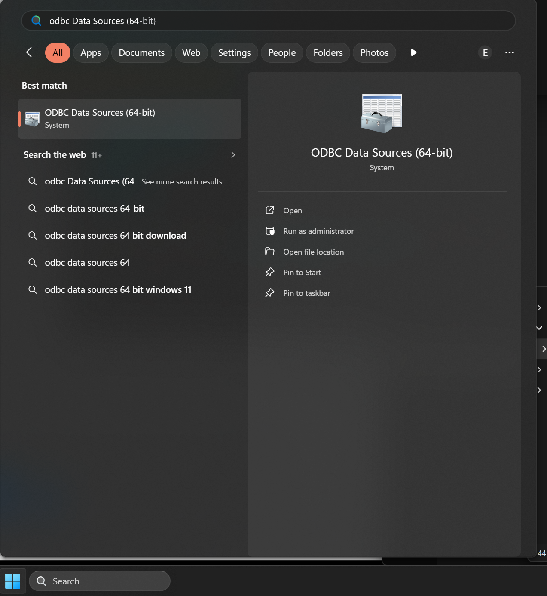
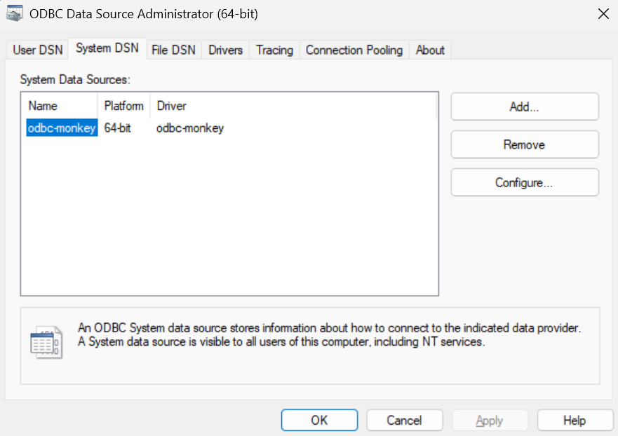
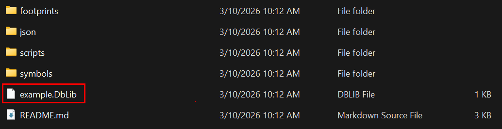
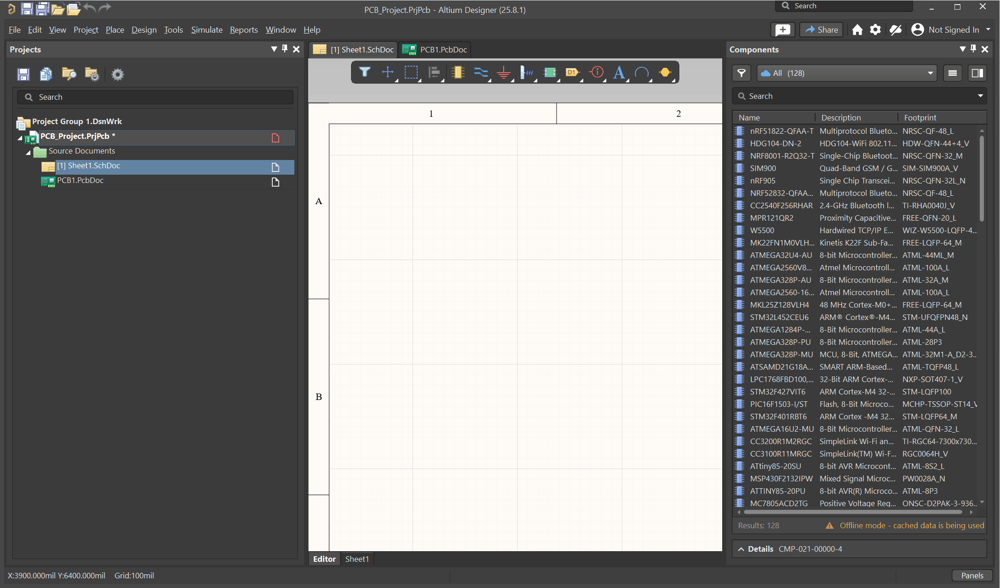

```
                    ▓▓▓▓▓▓▓▓▓▓
                  ▓▓▓▓▓▓▓▓▓▓▓▓▓▓
                ▓▓▓▓▓▓▓▓▓▓▓▓▓▓▓▓▓▓
              ▓▓▓▓░░░░░░▓▓░░░░░░▓▓▓▓
          ░░░░▓▓░░░░░░░░░░░░░░░░░░▓▓░░░░
          ░░░░▓▓░░  ██░░░░░░  ██░░▓▓░░░░
            ░░▓▓░░████░░░░░░████░░▓▓░░
              ▓▓░░░░░░░░░░░░░░░░░░▓▓
                ▓▓░░░░░░░░░░░░░░▓▓
                  ▓▓▓▓░░░░░░▓▓▓▓
                      ▓▓▓▓▓▓         ░░
                    ▓▓▓▓▓▓▓▓▓▓      ▓▓
                    ▓▓▓▓▓▓▓▓▓▓    ▓▓▓▓
                  ▓▓▓▓▓▓▓▓▓▓▓▓▓▓▓▓▓▓
                  ▓▓▓▓░░▓▓░░▓▓▓▓

```

# odbc-monkey 

A high-performance json ODBC driver designed for use with Altium Database Libraries (DbLib).

odbc-monkey supports git based workflows for your libraries and meta-data. 

The components panel is very fast as everthing is local and cached in memory.

odbc-monkey has been tooled to work as good as possible in Altium and its ODBC access pattern. 

Any wierd bugs left are on the altium side. The driver presents data in such a way that restarting altium is rarely required if the underlying files change.

This is most likely the swan song for altium dblibs. 

## Features

- **Designed For Speed** - optimized as a purely local dblib from json files w/ git
- **In memory cache** - All accesses use a redis style in-memory cache for speed
- **Live cache refresh** - File watcher for real-time updates when JSON files change.  You can build your own tools to manage the json files.
- **Non-locking reads** - Allows concurrent file editing.  You can update the json w/ Altium connected.
- **Schema from JSON data** - No hardcoded table schema in the driver
- **Versioned JSON support** - Extracts latest version by UUIDv7 
- **Unicode support** - Full UTF-8/UTF-16 handling so your can get the omega and micro symbols.
- **Dynamic Classification tables** - Tables based on `foo/bar --> foo#bar` format


## Install and Test

### 0. Clone this repo to static location

### 0.5 Install the Python helper package

If you want to import `generate_dblib()` from another Python project, install
this repo as a normal package:

```powershell
cd odbc-monkey
uv sync
```

or:

```powershell
pip install -e .
```

### 1. Run the `*install.ps1*` power shell script.  

It will ask for admin. 

This registers the `odbc-monkey` ODBC driver and creates or refreshes the `odbc-monkey` system DSN. 

It updates the registry to point to the .dll in the bin folder.

The install and uninstall scripts also clean up older `odbc-monkey` registrations, including prior versioned DLL installs such as `a0`.
 

### 2. Check the odbc admin (64-bit) to verify installation:





### 3. Run *rebuild_example.ps1* from a terminal.

This uses the python tooling in `dblib_builder.py` to scan the example JSON data and regenerate `example\example.DbLib`.

This also works through the packaged CLI:

```powershell
uv run odbc-monkey-dblib --json-path .\example\json --output .\example --name example
```

This is important to run. 

It autogens example/example.dblib with all the proper settings.

For large libraries it does all the work of automagically creating dblib for the target system.

### 4. Add `example.dblib` to your altium library setup





## Connection Strings

You can setup your dblib manually if you are insane (use the python script!)

```
# Using driver directly
DRIVER={odbc-monkey};DataSource=C:\path\to\json\files
```

## Project Structure

- `native/` - C++ driver source, native README, build/test scripts
- `example/` - Example JSON, symbols, footprints, generated DbLib
- `dblib_builder.py` - Python DbLib generator
- `rebuild_example.ps1` - Regenerates `example\example.DbLib`
- `gui/` - Python GUI test viewer

## Source

The c++ driver source, windows build scripts, and  tests live in `native/`. If you need to work on the driver itself, start with `native/README.md`.

## JSON File Format

See [JSON_FORMAT.md](JSON_FORMAT.md) for the full format specification.

Highlights:

Each JSON file represents one part with versioned history:

```json
{
  "versions": [
    {
      "id": "019370ab-1234-7000-8000-000000000001",
      "cad-reference": "CAP_0402_100nF",
      "Manufacturer Part Number": "GRM155R71H104KE14D",
      "Manufacturer": "Murata",
      "description": "100nF 50V X7R 0402",
      "value": "100nF",
      "classification": "capacitors/Murata_C0402",
      ...any other fields...
    }
  ]
}
```

The driver extracts the latest version based on UUIDv7 timestamp in the `id` field.

**Field name mapping**: The driver normalizes `description` -> `Description` and `value` -> `Value` for Altium compatibility. Use lowercase in JSON; ODBC consumers see capitalized names. 
**Version selection:**
- If `id` fields are present, the version with the highest UUIDv7 timestamp is used
- If no `id` fields are present, the first entry in the `versions` array is used
- The `classification` field (`category/table` format) determines which ODBC table the part belongs to

### Columns / Tables / Schema

There is no fixed built-in schema. Columns are discovered from the JSON data loaded for each table.

In practice, a table's exposed columns are based on the fields seen while that table is loaded.

If files in the same classification have inconsistent fields, not every field is guaranteed to appear as a column.

Rerun the python script if there is signficant changes to your classification structure.

I typically use the the same fields for a particular classification.

Table names use `foo#bar` format derived from the JSON `classification` field with foo/bar format.

Example:   ic/mcu  in the classification field will show up as the tbale ic#mcu in the components panel.

- `parts` - Returns all parts from all JSON files
- `foo#bar` - Returns parts filtered by classification (for example, `SELECT * FROM [capacitors#Murata_C0402]`)

## Implemenation Scope

`odbc-monkey` is built specifically for Altium Designer .dblib workflows.

It implements the subset of ODBC behavior needed by Altium and is tested primarily against Altium Designer. Other ODBC clients may work for basic browsing and queries, but broad ODBC compatibility is not a project goal.

Supported scope:

- Altium DbLib table discovery and column discovery
- `SELECT * FROM Parts`
- `SELECT * FROM [category#table]`
- Simple `WHERE` clauses using `=` and `LIKE`

Non-goals:

- Full SQL parser
- Full ODBC metadata coverage
- Compatibility with generic BI tools, ORMs, or arbitrary ODBC clients

### SQL Support

This driver supports a small SQL subset intended for Altium's access patterns:

```sql
-- All parts
SELECT * FROM Parts

-- Specific table
SELECT * FROM [capacitors#Murata_C0402]

-- With WHERE clause
SELECT * FROM Parts WHERE [Manufacturer Part Number] = 'GRM155R71H104KE14D'
```

It is not a full SQL engine. Arbitrary SQL syntax, advanced predicates, and broad client/tool compatibility are out of scope.

## Test GUI Viewer

A test python GUI for browsing the data.

run using uv (toml included)

```powershell
cd gui
uv run python odbc_viewer.py
```

## Third-Party Libraries

odbc_monkey uses an external json library.

- [nlohmann/json](https://github.com/nlohmann/json) - JSON for Modern C++ (MIT License)

## License and Customization

AGPLv3

Please reach out to ehughes@wavenumber.net for commercial licenses and customizations (other formats besides json)

## Release Notes

a1 : switch the Windows driver to the real ODBC SDK headers while preserving current Altium behavior
a0 : initial public release supporting the version JSON data model
